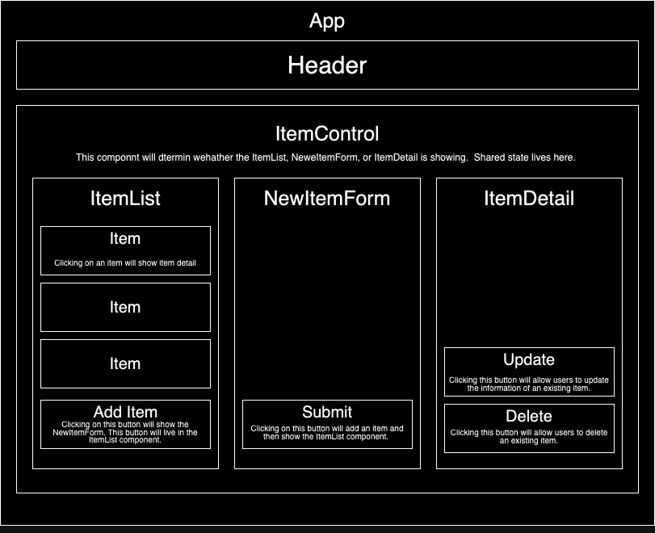

# Inventory Tracker

#### An app to track inventory utilizing React.

#### By Brianca Knight

## Technologies Used

* HTML
* React
* Javascript
* Bootstrap
* Node Package Manager
* Webpack
* CSS
* JSON
* Babel
* ESLint

## Description

This application utilizes React to create, update, and read inventory for a Refillery retailer. This update utiliizes react to manage state and react-redux for testing. 

## Setup/Installation Requirements

### Cloning Instructions
* Clone this repository to your desktop.
* Navigate to the top level of the directory. 
* Install Node.js with `npm install`
* To start the development server run `npm run start`
* Install redux and react-redux with `npm install redux@4.2.0 react-redux@8.0.2`
* To test run `nmp run test`

## Known Bugs

## License

Copyright (c) 2023 Brianca Knight

 